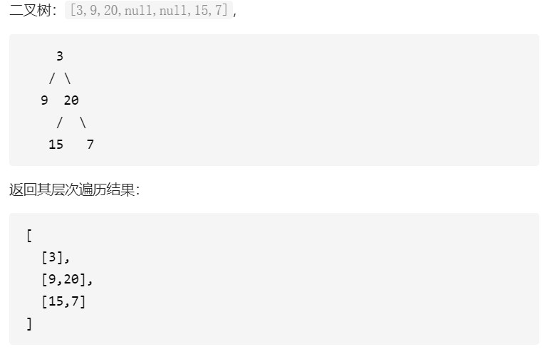

### 二叉树的层序遍历  
给你一个二叉树，请你返回其按 层序遍历 得到的节点值。 （即逐层地，从左到右访问所有节点）。  
示例：  
  
解题：  
```java
// 队列标记法
/**
 * Definition for a binary tree node.
 * public class TreeNode {
 *     int val;
 *     TreeNode left;
 *     TreeNode right;
 *     TreeNode(int x) { val = x; }
 * }
 */
class Solution {
    public List<List<Integer>> levelOrder(TreeNode root) {
        List<List<Integer>> res = new LinkedList<>();
        if (root == null) {
            return res;
        }
        // 创建队列
        LinkedList<TreeNode> queue = new LinkedList<>();
        // 创建辅助链表
        LinkedList<Integer> level = new LinkedList<>();
        // 创建分割符
        TreeNode seq = new TreeNode(Integer.MAX_VALUE);
        queue.addFirst(root);
        queue.addLast(seq);

        while (!queue.isEmpty()) {
            TreeNode cur = queue.removeFirst(); // 取出队首元素
            if (cur.equals(seq)) { // 取出的是分隔符
                res.add(level);
                // 创建新的层次链表
                level = new LinkedList<>();
                // 判断队列是否为空
                if (!queue.isEmpty()) {
                    // 添加分隔符
                    queue.addLast(seq);
                }
            } else { // 不是分隔符
                level.add(cur.val); 
                if (cur.left != null) { // 添加左子节点到队未
                    queue.addLast(cur.left);
                }
                if (cur.right != null) { // 添加右子节点到队末
                    queue.addLast(cur.right);
                }
            }
        }

        return res; 
    }
}
```
```java
// 深度优先遍历法
/**
 * Definition for a binary tree node.
 * public class TreeNode {
 *     int val;
 *     TreeNode left;
 *     TreeNode right;
 *     TreeNode(int x) { val = x; }
 * }
 */
class Solution {
    public List<List<Integer>> levelOrder(TreeNode root) {
        List<List<Integer>> res = new LinkedList<>();
        if (root != null) {
            dfs(res, root, 0);
        }

        return res; 
    }

    private void dfs(List<List<Integer>> res, TreeNode root, int level) {
        if (res.size() - 1 < level) { // level 最初是 0
            res.add(new ArrayList<>());
        }
        res.get(level).add(root.val);
        if (root.left != null) { // 递归深入左子树
            dfs(res, root.left, level + 1);
        }
        if (root.right != null) { // 递归深入右子树
            dfs(res, root.right, level + 1);
        }
    }
}
```