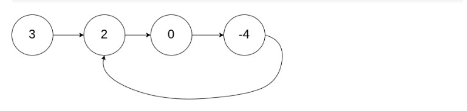
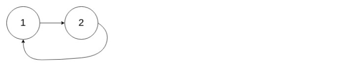
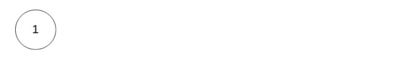

### 环形链表  
给定一个链表，判断链表中是否有环。  
为了表示给定链表中的环，我们使用整数 pos 来表示链表尾连接到链表中的位置（索引从 0 开始）。 如果 pos 是 -1，则在该链表中没有环。  
**示例1**  
>输入：head = [3,2,0,-4], pos = 1  
 输出：true  
 解释：链表中有一个环，其尾部连接到第二个节点。  

  
**示例2**  
>输入：head = [1,2], pos = 0  
 输出：true  
 解释：链表中有一个环，其尾部连接到第一个节点。  

  
**示例3**  
>输入：head = [1], pos = -1  
 输出：false  
 解释：链表中没有环。  

  

解答：  
```java
/**
 * Definition for singly-linked list.
 * class ListNode {
 *     int val;
 *     ListNode next;
 *     ListNode(int x) {
 *         val = x;
 *         next = null;
 *     }
 * }
 */
// 快慢双指针法
// 慢指针走一格，快指针走两格，如果有环两指针一定会相等
public class Solution {
    public boolean hasCycle(ListNode head) {
        if (head == null) {
            return false;
        }
        ListNode l1 = head, l2 = head.next;
        while (l1 != null && l2 != null && l2.next != null) {
            if (l1 == l2) {
                return true;
            }
            l1 = l1.next;
            l2 = l2.next.next;
        }
        return false;
    }
}
``` 