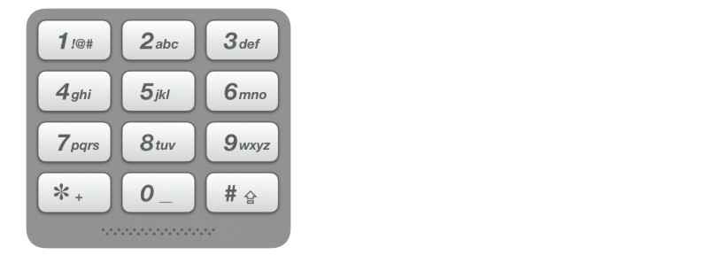

### 电话号码的字母组合  
给定一个仅包含数字 2-9 的字符串，返回所有它能表示的字母组合。  
给出数字到字母的映射如下（与电话按键相同）。注意 1 不对应任何字母。  

**示例**  
>输入："23"  
 输出：["ad", "ae", "af", "bd", "be", "bf", "cd", "ce", "cf"].  

解答：  
```java
import java.util.*;

// 递归法
class Solution {
    public List<String> letterCombinations(String digits) {
        List<String> res = new ArrayList<>();
        if (digits == null || digits.length() == 0) {
            return res;
        }

        Map<Character, String> map = new HashMap<>();
        map.put('2', "abc");
        map.put('3', "def");
        map.put('4', "ghi");
        map.put('5', "jkl");
        map.put('6', "mno");
        map.put('7', "pqrs");
        map.put('8', "tuv");
        map.put('9', "wxyz");
        search("", digits, 0, res, map);
        return res;
    }

    private void search(String s, 
                        String digits, 
                        int i, 
                        List<String> res,
                        Map<Character, String> map) {
        // terminator
        if (i == digits.length()) {
            res.add(s);
            return ;
        }
        
        // process
        String letters = map.get(digits.charAt(i));
        for (int j = 0; j < letters.length(); ++j) {
            search(s + letters.charAt(j), digits, i + 1, res, map);
        }
        // reverse
    }
}
```
