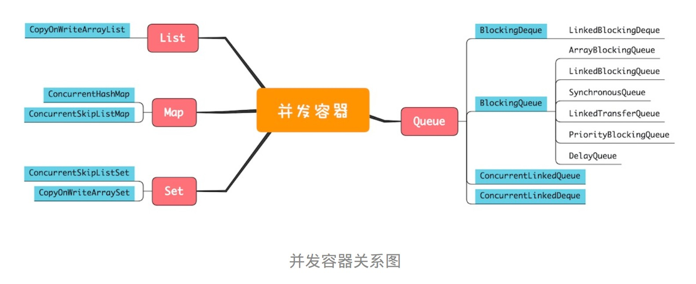

### 并发容器关系图  
  
### List  
CopyOnWriteArrayList:  
1、实现原理：CopyOnWriteArrayList内部维护了一个数组，成员变量 array 就指向了这个内部数组，所有的读操作都是基于 array 进行的；而对于写操作来说，CopyOnWriteArrayList会将 array 复制一份，然后在新复制处理的数组上执行写操作，执行完后 array 指向新的数组。  
2、两个“坑”：一个是应用场景，只适合于写操作非常少的场景；而是能够容忍读写短暂不一致。  
### Map
ConcurrentHashMap 和 ConcurrentSkipListMap  
1、区别：ConcurrentHashMap 的 key 是无序的，而 ConcurrentSkipListMap 的 key 是有序的；ConcurrentSkipListMap 相对来说操作的时间复杂度更加稳定，都是 O(log n)。  
2、相同点：两者都是线程安全的；key 和 value 都不允许为空。  
### Set  
CopyOnWriteArraySet 和 ConcurrentSkipListSet 使用场景参考	CopyOnWriteArrayList 和	ConcurrentSkipListMap，它们的原理都是一样的。  
### Queue  
两个维度：一个是是否阻塞（Blocking）；一个是单端（Queue）和双端（Deque）  
1、单端阻塞队列：ArrayBlockingQueue、LinkedBlockingQueue、SynchronousQueue、LinkedTransferQueue、PriorityBlockingQueue（支持优先级出队） 和	DelayQueue（支持延迟出队）。  
2、双端阻塞队列： LinkedBlockingDeque。  
3、单端非阻塞队列：ConcurrentLinkedQueue。  
4、双端非阻塞队列：ConcurrentLinkedDeque。  
